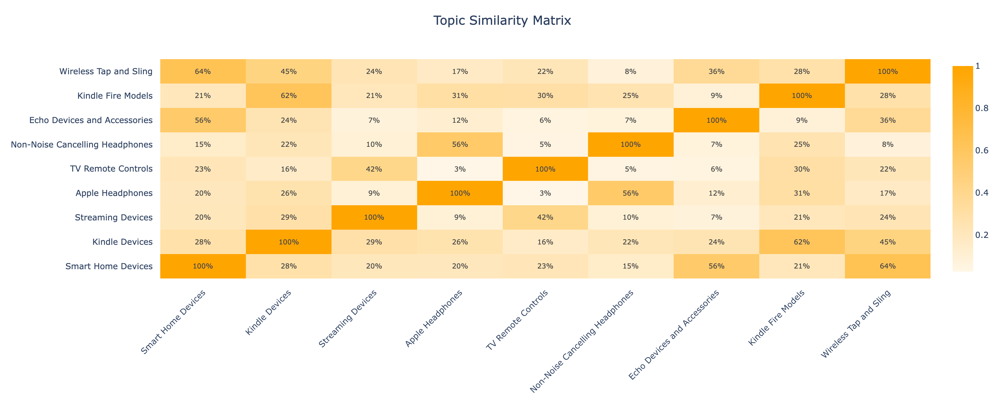

# Topic Modeling with BERTopic + GPT

This project demonstrates a modern approach to topic modeling using [BERTopic](https://github.com/MaartenGr/BERTopic), [Sentence Transformers](https://www.sbert.net/), and GPT. It uses a dataset of Amazon product reviews from [Kaggle](https://www.kaggle.com/datasets/datafiniti/consumer-reviews-of-amazon-products) as a working example, but the methods can be applied to any large set of short texts—like survey responses, support tickets, or social media comments.

Rather than relying on traditional word frequency–based models, this workflow uses sentence-level embeddings and cosine similarity to discover meaningful, interpretable topics. GPT is then used to generate concise topic names and descriptions.

---

## Blog Post

I wrote a blog post where I explain my approach more. You can read it [here](https://www.annielytics.com/blog/ai/topic-modeling-with-bertopic-and-gpt/).

---

## Project Structure

This is how I structured the project. If you want to use different data, add your csv to the data directory and update the reference in the file.

```
├── data/
│ └── product-reviews-kaggle.csv
├── img/
│ ├── topic-modeling-bubble-chart-icon.png
│ ├── topic-modeling-distribution-bar-chart.png
│ └── topic-modeling-similarity-matrix.png
├── output/
│ ├── topic_analysis_results.csv
│ ├── topic_analysis_report.txt
│ ├── topic_clusters_interactive.html
│ ├── topic_distribution_interactive.html
│ └── topic_similarity_interactive.html
├── .env
├── main.py
└── README.md
```

---

## Interactive Outputs for Exploration

To make findings more accessible, the script outputs three interactive visualizations using my fave Python plotting library, Plotly. I built out three charts just to demonstrate different ways you can visualize your topics.

### Topic Map Bubble Chart

I like using bubble charts to visualize the similarity and frequency of different topics. A bubble chart like this allows you to explore the topic landscape in 2D space, where distance reflects similarity.


---

### Topic Distribution Bar Chart

I used a simple bar chart to quickly see which topics were covered the most in the reviews.


---

### Topic Similarity Heatmap

I'm a sucker for heatmaps. The darker the cell, the more similar those topics are, with *Wireless Tap and Sling* and *Smart Home Devices* scoring the highest—and *Kindle Fire Models* and *Kindle Devices* coming in close second.



---

## How to Run the Code

### 1. Clone the Repository

```bash
git clone https://github.com/your-username/topic-modeling-gpt.git
cd topic-modeling-gpt
```

### 2. Install packages

Install the required packages:

```bash
pip install -r requirements.txt
```

### 3. Generate an OpenAI API key

You can create an API key [here](https://platform.openai.com/api-keys). Or use your model du jour. (Just update the model in the script.)

### 4. Create an .env file

To avoid using your API key in your code, you can create an .env file and store it there. All you need in this file is:

OPENAI_API_KEY=your-key-here

### 5. Run the file

You can run the file using:

```bash
python generate_topics.py
```